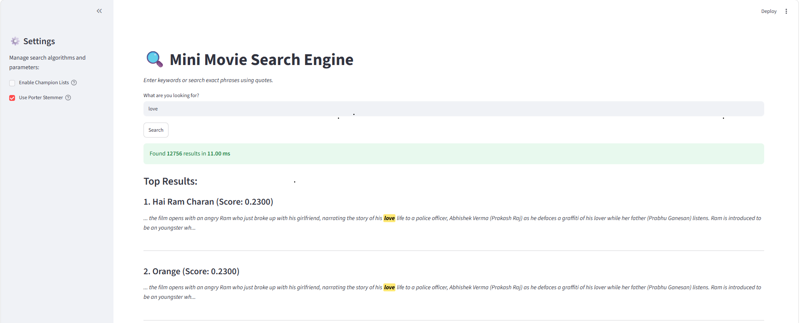

# Dokumentacija Projekta: Sistem za pretraživanje informacija (Information Retrieval)



Ovaj repozitorijum sadrži celokupan izvorni kod za samostalno implementiran sistem za pretraživanje informacija. Projekat je razvijen u jeziku Python, sa ciljem pretraživanja korpusa tekstualnih dokumenata (Wikipedia Movie Plots) uz strogo poštovanje pravila da se ne koriste gotove pretraživačke biblioteke (poput Elasticsearch, Lucene ili scikit-learn TfidfVectorizer modula). Sva logika indeksiranja, parsiranja i rangiranja napisana je od nule.

## 1. Arhitektura sistema i obrada teksta (Text Processing Pipeline)

Procesiranje teksta se vrši prilikom izgradnje indeksa, ali i nad samim korisničkim upitima, kako bi se osigurala uniformnost podataka. Pipeline (modul `text_processor.py`) obuhvata sledeće korake:
*   **Čišćenje i Tokenizacija:** Uklanjanje znakova interpunkcije korišćenjem regularnih izraza (`re` modul) i prevođenje svih karaktera u mala slova. Tokenizacija se vrši deljenjem stringa po prazninama (whitespace).
*   **Uklanjanje stop-reči:** Kreiran je lokalni set engleskih stop-reči (preuzet iz NLTK baze) čija se provera vrši u vremenskoj kompleksnosti O(1).
*   **Stemovanje (Porter Stemmer):** Preostali tokeni se propuštaju kroz algoritam za svođenje na koren reči. Ovaj korak je implementiran kao parametar (`use_stemmer=True/False`) kako bi se eksperimentalno mogao meriti uticaj morfološke analize na Recall i Precision sistema.

## 2. Struktura Invertovanog Pozicionog Indeksa

U modulu `indexer.py` implementirana je struktura pozicionog indeksa realizovana preko ugnježdenih Python rečnika (Hash mapa). Struktura izgleda ovako:

```json
{
  "term": {
      "doc_id_1": [pozicija1, pozicija2, pozicija3],
      "doc_id_2": [pozicija1]
  }
}
```

Ovakva struktura omogućava ekstremno brzu (O(1)) pretragu termina, istovremeno čuvajući frekvenciju termina u dokumentu (dužina niza pozicija predstavlja Term Frequency - TF) i tačne ofsete reči, što je neophodno za Bulovu fraznu pretragu.

## 3. Modeli pretrage (Retrieval Models)

Glavni pretraživački mehanizmi nalaze se u modulu `search_engine.py`. Sistem podržava dva režima rada koji se dinamički biraju na osnovu sintakse upita.

### 3.1. Vektorski model (Vector Space Model i TF-IDF)
Za slobodne upite (Free-text queries), sistem rangira dokumente računanjem kosinusne sličnosti (Cosine Similarity) između vektora upita i vektora dokumenata.
*   **TF-IDF težine:** Za svaku reč računa se inverzna frekvencija dokumenta: `IDF = ln(N / DF)`, gde je N ukupan broj dokumenata, a DF broj dokumenata koji sadrže termin. Težina je proizvod broja pojavljivanja reči i njenog IDF-a.
*   **Optimizacija normi:** Da bi se pretraga ubrzala, L2 norma (dužina vektora) za svaki dokument se računa unapred, tokom offline faze indeksiranja, i čuva u memoriji (`doc_lengths`).
*   **Kosinusna sličnost:** Prilikom pretrage, računa se skalarni proizvod vektora upita i dokumenta, koji se zatim deli sa proizvodom njihovih normi, dajući rezultat u opsegu [0, 1].

### 3.2. Bulova frazna pretraga (Exact Match)
Kada je upit prosleđen pod navodnicima, sistem prelazi u režim frazne pretrage:
1.  Pronalazi se presek (Intersection) svih dokumenata koji sadrže sve tražene termine.
2.  Za svaki kandidat-dokument, iterira se kroz pozicioni niz prvog termina.
3.  Proverava se da li sledeći termini prate sekvencijalni inkrement ofseta (`ocekivana_pozicija = start_pos + i`). Pretraga je striktna i zahteva tačan redosled i blizinu pretrage.

## 4. Heuristička optimizacija pretrage (Champion Lists)

Kako skalarni proizvod u vektorskom modelu zahteva iteraciju kroz sve dokumente koji sadrže upitne termine, implementirana je tehnika odbacivanja kandidata sa malim težinama radi povećanja performansi:
*   Tokom generisanja indeksa, za svaki termin se kreira takozvana **Champion Lista**.
*   Lista sadrži samo top-K (u našem slučaju K=50) dokumenata koji imaju najveću Term Frequency (TF) vrednost za taj specifični termin.
*   Prilikom pretrage sa uključenom heuristikom, sistem računa kosinusnu sličnost isključivo za dokumente unutar preseka Champion listi, čime se drastično smanjuje prostor pretrage (Search Space) i vreme izvršavanja svodi na jednocifren broj milisekundi, uz minimalan pad u kvalitetu rezultata.

## 5. Dinamički Highlighter (Korisnički interfejs)

Na prezentacionom sloju (`app.py`), implementiran je pametni algoritam za izdvajanje isečaka (Snippet extraction) pomoću regularnih izraza.
Ovaj algoritam komunicira sa Stemmer modulom: on analizira koren reči iz tekstualnog isečka dokumenta i upoređuje ga sa korenom reči iz korisničkog upita. Ukoliko dođe do poklapanja, HTML/CSS tagovi se generišu oko originalne reči, čime se dobija vizuelni "Highlight" efekat u rezultatima koji je otporan na gramatičke varijacije reči.

## 6. Uputstvo za instalaciju i pokretanje

**1. Kloniranje repozitorijuma:**

```bash
git clone https://github.com/USERNAME/REPO_NAME.git
cd REPO_NAME
pip install streamlit nltk
```

**2. Priprema podataka:**
Preuzmite dataset ("Wikipedia Movie Plots" CSV) i smestite ga u folder `data/` pod imenom `wiki_movie_plots_deduped.csv`.

**3. Offline generisanje indeksa:**
Pokrenite skriptu za indeksiranje koja će kreirati dva modela (sa i bez upotrebe stemera):

```bash
python src/indexer.py
```

**4. Pokretanje sistema:**
Pokrenite Streamlit web aplikaciju lokalno:

```bash
streamlit run app.py
```